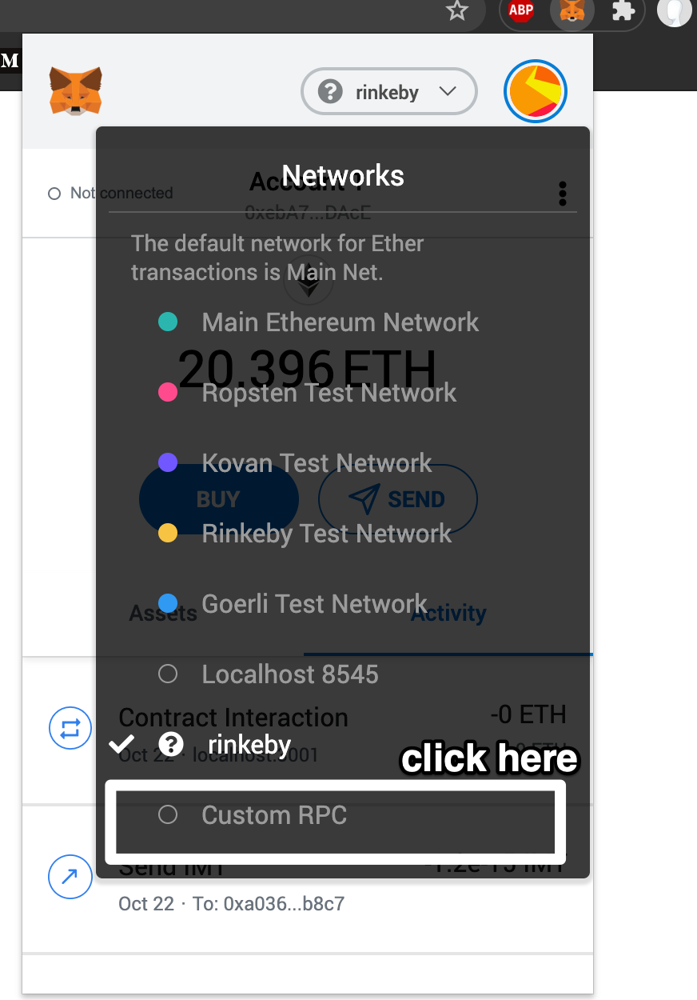

# bulk-sender

This projet generate wallets in json file, and send bulk tokens to those addresses, it can also used to consult wallet's balance.

## Metamask configuration

In order to configureMetaMask:
  - create new network and add your infura mainnet/rinkeny link
  
  - connect your account(it will be automatically requested)

## Config.js configuration 
Add your main and bridge smart contracts addresses
```shell
config.sm_bridge = bridge smart contracts address, make sur you have passed sm_address in sm_bridge constructor
config.data_path = path where wallets will be saved, update not needed;
```

### `yarn`
Install required packages for the app.
### `yarn start`

Runs the app in the development mode.<br />
Open [http://localhost:3000](http://localhost:3000) to view it in the browser.

The page will reload if you make edits.<br />
You will also see any lint errors in the console.


